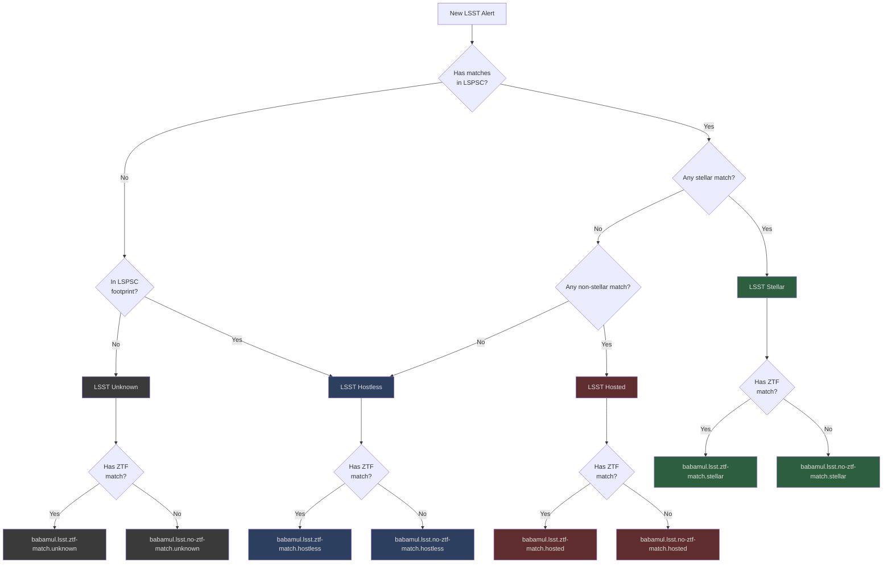
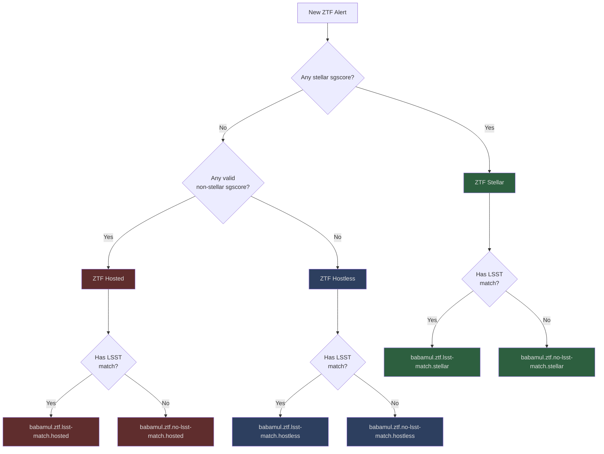

# Babamul

BOOM's Babamul feature provides public access to BOOM's
transient alert streams via Kafka.
Users sign up with an email address and receive credentials for both Kafka
stream access and optional API endpoints.

**Interactive documentation**: `/babamul/docs` (Swagger UI)

## Account separation

Babamul accounts are isolated from main BOOM API accounts:

- **Database**: Stored in separate `babamul_users` collection
- **JWT claims**: Subject contains `babamul:` prefix (e.g., `babamul:{user_id}`)
- **Access control**: Middleware rejects Babamul tokens on main API endpoints
- **Permissions**: Babamul users can only access `/babamul/*`
  endpoints and `babamul.*` Kafka topics

## Authentication flow

1. **Signup** (`POST /babamul/signup`): User provides email, system creates account with activation code
2. **Activation** (`POST /babamul/activate`): User submits activation code, receives 32-character password (shown once)
3. **Kafka access**: Use email + password with SCRAM-SHA-512 authentication
4. **API access** (`POST /babamul/auth`): Exchange email + password for JWT token

## Social sign-in (Google, GitHub, ORCID)

Users can also sign in with a Google, GitHub, or ORCID account instead of an
email and password. This is an OAuth 2.0 authorization-code flow with PKCE,
run entirely server-side — the browser never holds a client secret.

```
browser  ──GET /babamul/oauth/{provider}/start──▶  API
API      ──302──▶  provider consent screen
provider ──302 ?code&state──▶  /babamul/oauth/{provider}/callback
API      ──code + PKCE verifier──▶  provider token endpoint  (server-to-server)
API      ──302 {webapp_url}/oauth/callback#access_token=…──▶  browser
```

The JWT comes back in the URL *fragment*, which browsers never transmit, so it
stays out of access logs and `Referer` headers. The web app reads it, stores it
the same way a password login would, and clears the fragment. The confirmation
email's link uses a fragment for the same reason.

`id_token`s are read without verifying their signature, which OIDC Core §3.1.3.7
permits when the token comes straight from the token endpoint over TLS in
response to a client-secret-authenticated request. The registered claims are
still checked — `iss`, `aud` (must be our client ID), and `exp` — since TLS only
attests that the bytes came from the host we dialled, not that the token was
minted for us.

### Endpoints

| Endpoint | Purpose |
| --- | --- |
| `GET /babamul/oauth/providers` | Providers this deployment has configured; the web app renders a button per entry |
| `GET /babamul/oauth/{provider}/start` | Redirects to the provider. Optional `redirect_to` names an in-app path to land on afterwards |
| `GET /babamul/oauth/{provider}/callback` | Provider redirects here; ends with a redirect back to the web app |
| `POST /babamul/oauth/complete` | Supply an email for a sign-in that came without one; mails a confirmation code |
| `POST /babamul/oauth/verify` | Hand back that code to finish the sign-in and receive a JWT |

All of these are public — they are how a caller obtains a token in the first
place.

### Account resolution

1. An account already linked to the same `(provider, subject)` pair is reused.
   The join key is the provider's stable user id, never the email.
2. Otherwise, if the provider asserts the email is **verified** and an account
   with that email exists, the identity is linked to it. So a user who signed
   up with a password can later just press the Google button.
3. Otherwise, still with a verified email, a new account is created, already
   activated: the provider authenticated the user and vouched for the address,
   so there is nothing left to confirm.
4. Otherwise — no email, or one the provider won't vouch for — the user is sent
   through the email confirmation flow below. An unverified address is never
   trusted on its own; that would be an account-takeover vector.

Accounts created this way have no usable password. `POST /babamul/forgot-password`
sets one if the user wants Kafka access via SCRAM.

### Email confirmation (the usual ORCID path)

Most ORCID researchers keep their email private, and the OIDC `id_token` only
guarantees the ORCID iD. The API tries ORCID's public API for an address and
accepts one only if ORCID explicitly marks it verified; otherwise the user is
asked for an address and has to prove they control it.

```
callback  ──302 {webapp}/oauth/complete#ticket=…──▶  browser
browser   ──POST /babamul/oauth/complete {ticket, email}──▶  API   (mails a code)
browser   ──POST /babamul/oauth/verify   {ticket, code}──▶   API   (returns a JWT)
```

The **ticket** is a short-lived record in `babamul_pending_identities` holding
the identity the provider authenticated. **No account exists until the code
comes back** — an abandoned sign-in leaves nothing behind but a row that a TTL
index sweeps up after 30 minutes.

On confirmation, if an account already owns that address the identity is linked
to it; otherwise a new activated account is created. Linking to an existing
account is safe here for the same reason a password reset is: the user proved
control of the mailbox.

Wrong codes are capped at 5 attempts per ticket, after which the ticket is
burned and the user starts over. A ticket will also only ever produce 5
confirmation codes, so one sign-in cannot be turned into an unlimited supply of
mail to an address the sender picks. Signing in again with a provider whose
account never finished confirmation does *not* skip it — the only thing that
can stand in for the confirmation is the provider re-asserting that exact
address as verified.

The ORCID iD is stored in `orcid_id` and shown on the profile page.

### Display name

Whatever the provider calls the user seeds the account's `name`, which the
profile page shows and `PATCH /babamul/profile` edits — sending a blank one
clears it. It is free text: optional, not unique, and never used to identify
the account. Linking a second provider fills it in only when the account has no
name yet, so a name the user typed is never overwritten. That is separate from
`username`, which is derived once at signup (from the provider's name, or the
local part of the email) and does not change.

### Configuration

**Client IDs and secrets are environment-only.** They are deliberately absent
from `config.yaml`, which is committed — see `.env.example`:

```sh
BOOM_BABAMUL__OAUTH__GOOGLE__CLIENT_ID="…"
BOOM_BABAMUL__OAUTH__GOOGLE__CLIENT_SECRET="…"
```

A provider is enabled exactly when both halves of its credential are present;
there is no separate `enabled` flag to drift out of step with the secret. Fill
in neither and that button never renders, fill in one and the provider stays
off — it fails closed rather than sending users to a consent screen that will
reject them.

Only the non-secret settings live in YAML:

```yaml
babamul:
  oauth:
    redirect_base_url: https://babamul.caltech.edu/api
    orcid_sandbox: false # true points ORCID at sandbox.orcid.org
```

Register this redirect URI with each provider; it must match byte for byte:

```
{redirect_base_url}/babamul/oauth/{google|github|orcid}/callback
```

In-flight authorization requests live in the `babamul_oauth_states` collection.
Each is consumed exactly once by the callback, which is what stops both CSRF
and code replay; abandoned ones are swept by a TTL index created at startup.

## Kafka access

After activation, connect to Kafka using:

- **Username**: Email address
- **Password**: Password from activation response
- **Mechanism**: SCRAM-SHA-512
- **Topics**: `babamul.*` (READ, DESCRIBE)
- **Consumer Groups**: `babamul-*` (READ)

### Example (Python)

This example uses the `confluent_kafka` package.

```python
from confluent_kafka import Consumer

# Subscribe to the babamul.none topic, which includes alerts that aren't
# stars, aren't galaxies, and have no cross-matches
consumer = Consumer(
    {
        "bootstrap.servers": "kafka.boom.example.com:9092",
        "security.protocol": "SASL_PLAINTEXT",
        "sasl.mechanisms": "SCRAM-SHA-512",
        "sasl.username": "user@example.com",
        "sasl.password": "your-password-here",
        "group.id": "babamul-myapp",
        "auto.offset.reset": "earliest"
    }
)

consumer.subscribe(["babamul.none"])

try:
    while True:
        msg = consumer.poll(timeout=1.0)
        if msg is None:
            continue
        if msg.error():
            print(f"Consumer error: {msg.error()}")
            continue
        print(msg.value())
finally:
    consumer.close()
```

## Object appearance in output topics

When an object is observed by multiple surveys,
alerts include survey match data in the
`survey_matches` field.
Topics follow the pattern: `babamul.{source_survey}.{other_survey}-match.*`.

On the first observation of a given object,
the alert has empty `survey_matches`.
When the object
is subsequently observed by another survey,
that alert includes information from
the other survey in its `survey_matches` field.
From that point forward, alerts on both streams include
`survey_matches` in their alerts.

### Multi-survey object appearance flow

```mermaid
sequenceDiagram
    participant LSST as LSST
    participant ZTF as ZTF
    participant Stream as Babamul topics

    Note over LSST,Stream: Day 1: Object discovered by LSST
    LSST->>Stream: Object discovered (stellar)
    rect rgb(95, 63, 45)
    Note over Stream: Topic: babamul.lsst.no-ztf-match.stellar<br/><br/>Survey matches: none
    end

    Note over ZTF,Stream: Day 3: ZTF observes same object
    ZTF->>Stream: Object observed (stellar)
    rect rgb(45, 63, 95)
    Note over Stream: Topic: babamul.ztf.lsst-match.stellar<br/><br/>Survey matches: lsst
    end

    Note over LSST,Stream: Day 5: LSST observes again
    LSST->>Stream: Object re-observed (stellar)
    rect rgb(45, 95, 63)
    Note over Stream: Topic: babamul.lsst.ztf-match.stellar<br/><br/>Survey matches: ztf
    end

    Note over ZTF,Stream: Day 7+: LSST and ZTF continue observing
    ZTF->>Stream: Subsequent observations
    rect rgb(45, 63, 95)
    Note over Stream: Topic: babamul.ztf.lsst-match.stellar<br/><br/>Survey matches: lsst
    end
    LSST->>Stream: Subsequent observations
    rect rgb(45, 95, 63)
    Note over Stream: Topic: babamul.lsst.ztf-match.stellar<br/><br/>Survey matches: ztf
    end
```



### Alert classification and topic assignment flow

#### LSST alerts

LSST alerts are first classified based on LSPSC catalog matches, then assigned to topics
based on their classification and whether they have a ZTF match.



#### ZTF alerts

ZTF alerts are first classified based on stellar properties and star-galaxy scores, then assigned
to topics based on their classification and whether they have an LSST match.



## Usage analytics

Babamul usage is measured server-side only: API requests we already serve, and
Kafka consumer-group offsets we already hold. The Python package ships no
analytics SDK and reports nothing from users' machines — it only identifies
itself with a `User-Agent` naming the package version, Python version and OS.

See [analytics.md](analytics.md) for the events, metrics, and what is
deliberately not collected.
